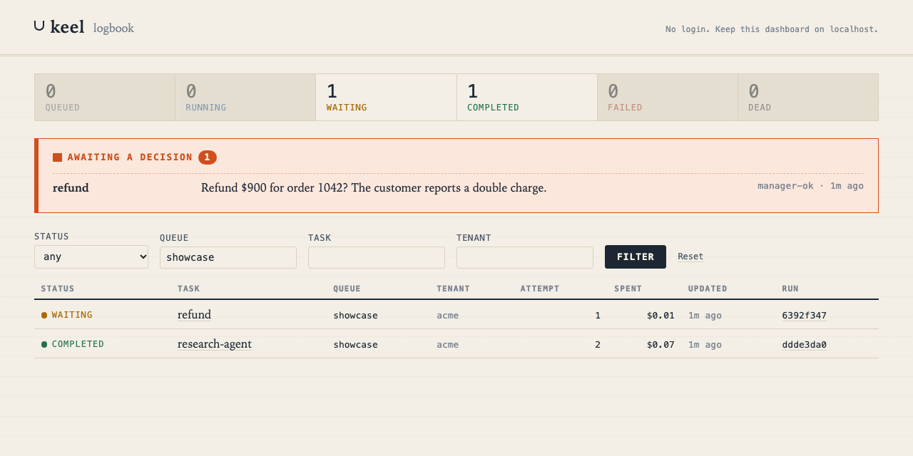
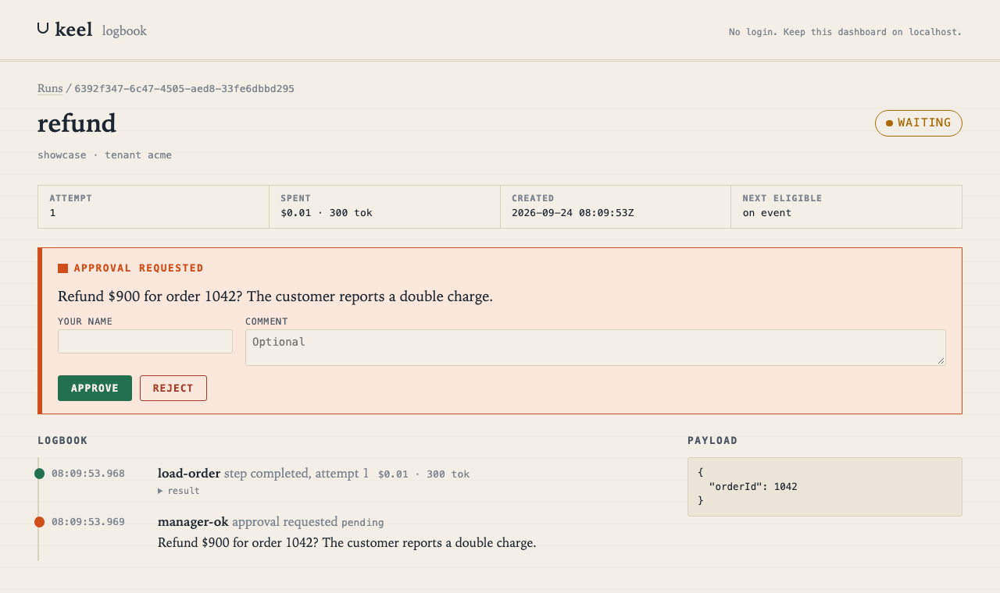
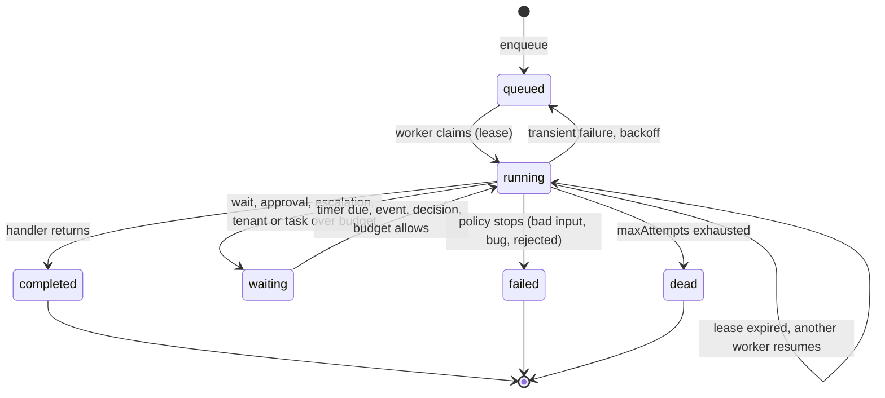

# keel

**A durable execution engine for AI agents, in TypeScript on Postgres.**

keel runs background jobs and multi-step agent workflows so they survive crashes, retry intelligently, stay within budget, and hand off to a person when they should.

[](https://github.com/yodablocks/keel/actions/workflows/ci.yml)


---

## Why keel

Most job engines treat an AI agent as just another long-running job: when a step fails, they retry it. Agents fail in ways that make blind retries wrong:

- A **hallucinated tool call** won't fix itself on retry. The model needs to be told what it got wrong.
- A **refund over an approval limit** shouldn't be retried at all. A person has to decide.
- A **runaway agent** can burn through an LLM budget faster than any rate limit notices.

keel works out *why* a step failed and acts on it. It treats tokens and dollars as a scheduling resource, and makes human approval a normal part of a workflow.

## Features

| | |
|---|---|
| **Durable steps** | `ctx.step.run()` stores each step's result. After a crash or retry, completed steps replay from storage instead of running again. |
| **Failure classification** | Every failure is classified as `transient`, `bad_input`, `bad_output`, `needs_human`, `over_budget` or `fatal`, and a policy picks the action: back off, retry with a corrective hint, fall back to a cheaper model, fail, or escalate. |
| **Jev classifier** | An optional classifier that reads error *messages*, the failing step and the rejected model output, not just status codes, using [TypeSafe's Jev](https://docs.typesafe.ai) model, with a rule-based fallback. |
| **Budgets** | Per-run budgets stop a run before its next step, and can fall back to a cheaper model instead of stopping. Tenant and per-task daily budgets defer runs instead of failing them. |
| **Human in the loop** | Approvals inside workflows, and escalated failures that wait for a reviewer's decision. |
| **Safe side effects** | Each step gets a stable idempotency key, so a step re-run after a crash can't charge a card twice. |
| **Waits and events** | Durable sleeps and waits for external events that free the worker in the meantime. |
| **Dashboard** | `pnpm dashboard`: a run list, a logbook of each run (steps, costs, errors, decisions), and Approve/Reject for pending approvals. No dependencies, no JavaScript. |
| **Serverless mode** | `worker.runOnce({ deadlineMs })` works through due runs and returns, for cron jobs and serverless functions. A run cut off by the deadline resumes from its last stored step on the next call. |
| **Crash safety** | Postgres `SKIP LOCKED` claims, leases with heartbeats, fenced writes, and dead-lettering of runs that keep crashing their workers. |

## Quick start

Requires Node.js 24+, pnpm 10+ and Docker.

```sh
git clone git@github.com:yodablocks/keel.git && cd keel
pnpm install
cp .env.example .env          # optionally add TYPESAFE_API_KEY for the Jev classifier
pnpm db:up && pnpm db:migrate # Postgres 17 on localhost:5433
pnpm demo --offline           # the end-to-end agent demo, no API key needed
```

## Example

```ts
import { createEngine } from "keel"; // see "Use it in your project" below

const engine = createEngine({ connectionString: process.env.DATABASE_URL! });

const worker = engine.createWorker({
  queue: "agents",
  tasks: {
    refund: async ({ orderId, amount }, ctx) => {
      const order = await ctx.step.run("load-order", () => orders.get(orderId));

      if (amount > 500) {
        const decision = await ctx.approval.request("manager-ok", {
          prompt: `Refund $${amount} for order ${orderId}?`,
          timeoutMs: 24 * 3600_000,
        });
        if (decision.status !== "approved") return decision.status;
      }

      return ctx.step.run("refund", ({ idempotencyKey }) =>
        payments.refund(order.chargeId, amount, { idempotencyKey }),
      );
    },
  },
});
worker.start();

await engine.enqueue("refund", { orderId: 42, amount: 900 }, { queue: "agents", budget: { usd: 2 } });
```

If the worker crashes after `load-order`, another worker resumes the run without loading the order again. While the run waits for approval it holds no worker at all.

No long-lived process? Call `await worker.runOnce({ deadlineMs: 25_000 })` from a cron job or a serverless function instead of `worker.start()`.

See the **[guide](docs/guide.md)** for every feature: steps, waits, budgets, the classifier, approvals, and the rules that keep replay correct.

## Use it in your project

keel is not published to npm. Build a tarball and add it to your project:

```sh
cd keel && pnpm pack                        # builds dist/ and writes keel-0.0.0.tgz
cd ../your-app && pnpm add ../keel/keel-0.0.0.tgz pg
```

The package ships compiled JavaScript with type declarations, the SQL migrations, and the TypeScript sources for source maps. Run `migrate(connectionString)` once at startup, or `pnpm db:migrate` from the keel checkout.

## Dashboard

```sh
pnpm dashboard   # http://127.0.0.1:4400
```



Each run has a logbook: steps with their cost, failures with how they were classified and what the policy did, and waits and decisions, in the order they happened. Pending approvals and escalations can be decided right there.



The dashboard has **no login**. It listens on `127.0.0.1` by default; don't expose it to a network. Pages allow no scripts, forms carry a per-process token, and requests for other hostnames are refused.

## Performance

`pnpm bench` on an Apple M4 (10 cores, 32 GB), Node 25, Postgres 17 in Docker on the same machine. Each run executes one durable step; 2,000 runs per configuration; all workers in **one Node process**:

| Workers | Runs per second |
|---|---|
| 1 | 445 to 471 |
| 2 | 861 to 873 |
| 4 | 1,365 to 1,442 |
| 8 | 1,618 to 1,683 |
| 16 | 1,897 to 1,904 |
| 32 | 1,974 to 2,023 |

Enqueue to completion on idle workers: **p50 26 ms, p99 51 to 55 ms**. That is mostly the default 50 ms polling interval.

- Throughput scales to 32 workers. An earlier version plateaued at 8 workers and dipped at 32. Profiling showed Node using under half of one core, and the cause was every step updating the same daily spend row per task. Spend is now sharded over 16 rows, which lifted 32 workers from about 1,600 to 2,000 runs per second, at the cost of about 12 to 15% at 4 to 8 workers.
- These are single-machine numbers with the database next to the workers, from a small number of runs each. Network latency to a managed Postgres, more workers per process, or heavier steps change them. Rerun `pnpm bench` on your own setup; raw results are in [`bench-results/`](bench-results/).

## How it works

Runs are rows in Postgres. Workers claim them with `FOR UPDATE SKIP LOCKED` and hold a lease that heartbeats extend. Completed steps, waits and usage are stored per run, so any worker can resume any run by replaying its handler.



When a handler throws, the error goes through a **classifier** (what kind of failure is this?) and then a **policy** (what should happen?):

| Failure | Kind | Default action |
|---|---|---|
| HTTP 408/429/5xx, timeouts, connection resets | `transient` | retry with exponential backoff and full jitter |
| Model output that can't be used (invalid JSON, unknown tool) | `bad_output` | retry at once, with the error passed to the handler as `ctx.hint` |
| Invalid input (HTTP 400/422, validation errors) | `bad_input` | fail |
| Approval limits, refusals, missing permissions | `needs_human` | escalate to a reviewer |
| Run over its budget | `over_budget` | fall back to a cheaper model once, if configured; otherwise escalate to a reviewer |
| Anything else | `fatal` | fail |

## Demo

`pnpm demo` runs one agent (research, plan, draft, send, follow-up) across two worker processes, with a scripted fake model and tools that misbehave on cue. In a single run:

1. **Hallucinated tool.** The model calls `serch_web`. Jev classifies the plain error as `bad_output` (confidence 0.96), and the retry's hint fixes the plan.
2. **Crash.** Worker A is `SIGKILL`ed mid-draft. Worker B resumes, and the earlier steps are replayed from storage, not called again.
3. **Rate limit.** The email API returns 429. The run backs off and retries with the same idempotency key.
4. **Over budget.** The run has spent $0.13 of its $0.125 budget, so it escalates instead of failing.
5. **Approval.** A reviewer raises the budget and approves, and the run completes.

The full recording, made with real Jev, is in [docs/demo-transcript.txt](docs/demo-transcript.txt). `pnpm test` runs the offline version and checks every moment.

## Failure classification: rules vs Jev

`pnpm eval:classifier` on 30 hand-labelled agent failures, `jev-latest`, September 2026:

| Classifier | First run (M7) | Latest run (M11) |
|---|---|---|
| Rules only (status codes, error codes, error classes) | 14 / 30 (47%) | 14 / 30 (47%) |
| Jev, error and task only | 29 / 30 (97%) | 30 / 30 (100%) |
| Jev with the failing step and model output | | 30 / 30 (100%) |
| keel cascade (rules for explicit signals, Jev for the rest, rules below 0.5 confidence) | 29 / 30 (97%) | 30 / 30 (100%) |

- Rules can only read status and error codes; Jev also reads the message, and since M11 the step that failed and what the model produced.
- The M7 miss, an ambiguous tool-argument error, is classified correctly in the latest run even **without** step context, so the fix can't be credited to context alone. The M7 run did not record the concrete model version behind `jev-latest`, so a model update can't be ruled out; runs now record it.
- What step context measurably changes is confidence: on that ambiguous case it rose from 0.60 to 0.75, it rose on every `bad_output` case, and the mean across all 30 went from 0.90 to 0.92 (up on 9 cases, down on 4).

**Caveat:** the eval set is synthetic, and it was written and labelled by the same author as the classifier prompt. At 100% it is also too easy to show further gains. It shows the mechanism works, not how it will perform on your production failures. To build a real set, `pnpm eval:export` writes your runs' actual failures to a file for labelling, and `pnpm eval:classifier --cases <file>` scores it. Full results are in [`eval-results/`](eval-results/).

## Status and limitations

keel is an **experimental project**, and the name is not final. All planned milestones are implemented and tested ([PLAN.md](PLAN.md)), but it hasn't been used in production. Known limitations include:

- Budgets can overshoot by one step, because a step's cost is known only after it runs.
- Idempotency keys protect external calls only for services that accept them.
- Retention is opt-in: without `retention` on a worker or calls to `engine.purge`, finished runs are kept forever.
- A single Postgres instance is the throughput ceiling: about 2,000 runs per second in the benchmark above.
- The dashboard has no authentication, so it is for local or internal use only.

The full list is under [Known risks](PLAN.md#known-risks), each tagged with the milestone that addresses it.

**Roadmap:** phases 1 and 2 are complete; see [PLAN.md](PLAN.md) for what was built, the measured results, and the deliberate [non-goals](PLAN.md#non-goals).

## Development

```sh
pnpm test        # node:test against the real Postgres from docker-compose (no database mocks)
pnpm typecheck   # tsc --noEmit
pnpm db:migrate  # applies db/migrations/*.sql in order
pnpm build       # compiles src/ to dist/ (JavaScript and type declarations)
pnpm bench       # throughput and latency, results in bench-results/
```

CI ([`.github/workflows/ci.yml`](.github/workflows/ci.yml)) runs the type check and the full test suite against Postgres 17 on every pull request and every push to `main`.

Node runs the TypeScript sources directly, so there is no build step. Tests include real crash recovery: worker processes are killed with `SIGKILL` mid-run.

```
src/          engine, failure classification, Jev classifier, migrations
db/           SQL migrations
test/         unit, integration and crash tests
scripts/      demo, classifier eval, migrate
docs/         guide and demo transcript
PLAN.md       milestones, acceptance criteria, known risks
```

## License

[MIT](LICENSE)
